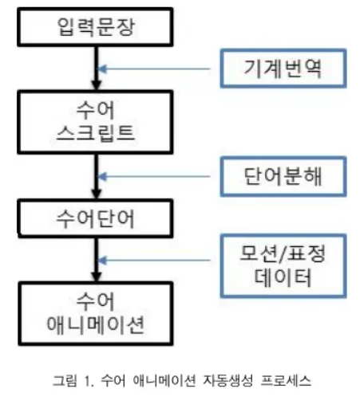

### 수어 기본 문장

- 주어, 서술어, 목적어 등으로 이루어져 서술 기능을 한 번 수행

  - 서술어 자리에 동사, 형용사, 명사 다 올 수 O
  - 서술격 조사 (~이다) 필요로 하지 X
  - {휴지}가 조사와 서술격조사의 역할
    - 휴지 : 일반적으로 문장을 끊는 "일시적인 멈춤"을 의미

- 수어 : 고립어적 특성 → 개별 동작(한 단어)을 연결해 하나의 문장을 만듦
- 주어 - 목적어 - 동사 순서
  - 근데 유연하게 조정 가능
- 조사 ‘~부터’, ‘와/과’ 두 종류뿐
- 동사 뒤에 부사, 의문사(육하원칙) 위치함
  - ex) ‘철수가 빨리 뛴다.’ → ‘철수’ + ‘뛰다’ + ‘빠르다’
  - ex) ‘무엇을 도와드릴까요?’ → ‘돕다’ + ‘무엇’
- 비수지 신호(손과 팔 이외의 표현) : 시제, 부정법 가능
- 판정 의문문 (답 yes or no) : 문장의 끝에서 눈썹을 올리고 입 모양을 ‘오’
- 수어 조사 없어서 주어와 목적어를 손의 위치로 나타냄
- 수어소 : 수어의 뜻을 구별해주는 가장 작은 단위

  - 손의 모양 (수형)
  - 손의 움직임 (수동)
  - 손의 위치 (수위)
  - 손바닥 방향 (수향)

  
