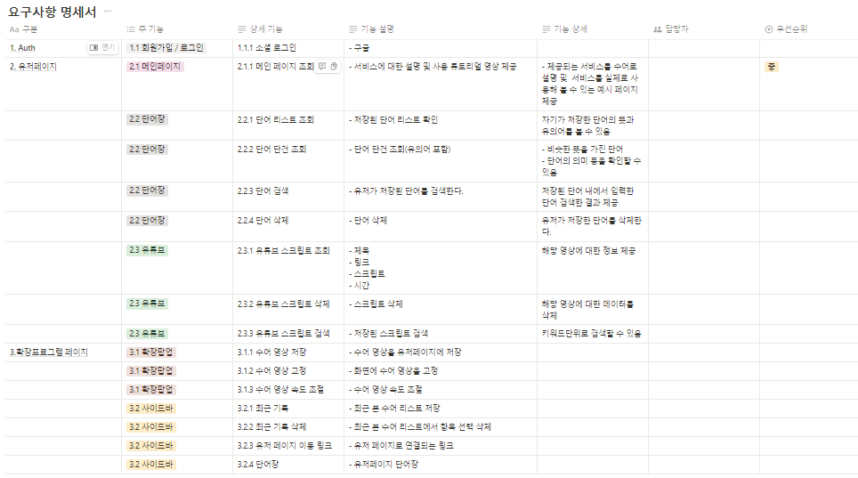
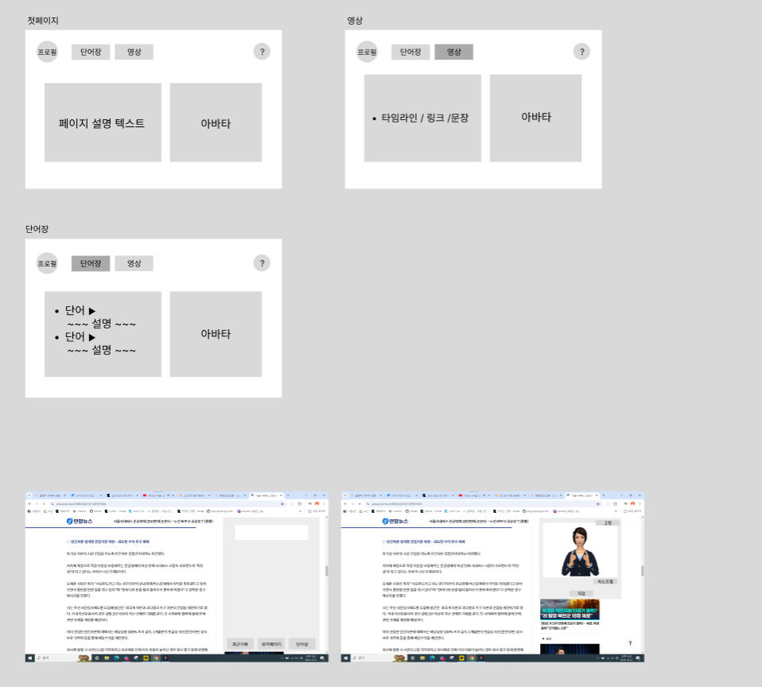
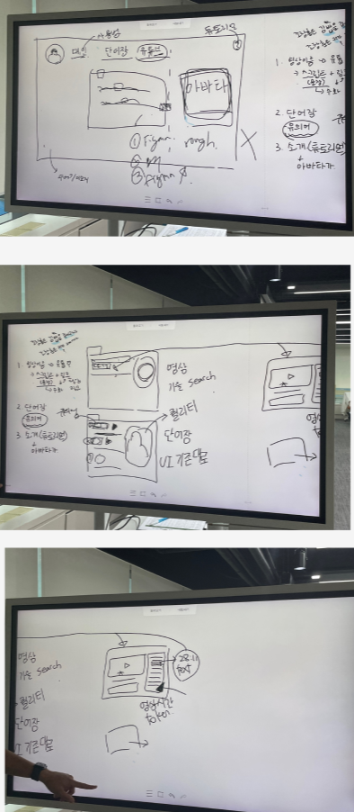

# 241022
## 요약: 아이디어 확정

#### 수어 확장 프로그램
- 인터넷상의 text를 클릭 시 수어 영상이 나올 수 있도록
- 영상에도 확장시켜보자.

---
#### 요구사항 명세서
- 미완성상태

#### 와이어프레임
- 디자인전 단계

#### 기획 회의

### 현실가능성
- 수어 아바타를 만들 수 있을까?
- 1. python torch를 활용한 레퍼 코드 찾음
    - [https://github.com/carolineec/EverybodyDanceNow](https://github.com/carolineec/EverybodyDanceNow)
    - 코드실행해보기
- 2. openai 활용법 확인